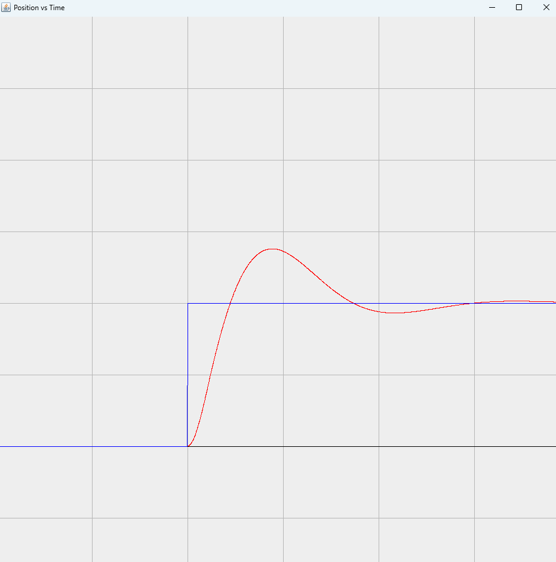

# GenericPID

A full implementation of motor PID control from scratch with many features, such as:
    * Motor control profiles
    * Artificial motor simulation
    * Custom complex paths
    * Generic interfaces for custom implementation
    * Auto-tuning using multidimensional gradient descent (in-progress)

Created for ChainLynx 8248 Robotics, 2023.
All code by and Copyright (c) Miles Caprio 2023.